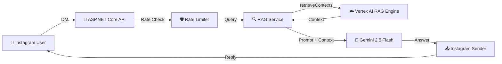

# InstaRAG — Instagram DM RAG Assistant

> 🤖 Automatically answers product-related questions via Instagram DMs using Google Vertex AI RAG Engine and Gemini 2.5 Flash.

[](https://dotnet.microsoft.com)
[](https://ai.google.dev)
[](LICENSE)

## Architecture



## Prerequisites

- [.NET 8 SDK](https://dotnet.microsoft.com/download/dotnet/8.0)
- [Google Cloud Account](https://console.cloud.google.com) with Vertex AI API enabled
- [Meta Developer Account](https://developers.facebook.com) with an Instagram Professional account
- [Docker](https://www.docker.com) (for containerized deployment)

## Quick Start

### 1. Clone & Install

```bash
git clone <your-repo-url>
cd Instagram
dotnet restore
```

### 2. Configure Google Cloud

1. **Create a GCP Project** and enable the **Vertex AI API** and **Cloud Storage API**
2. **Create a Service Account**:
   - Go to IAM & Admin → Service Accounts
   - Create with roles: `Vertex AI User` + `Storage Object Admin`
   - Download the JSON key file
3. **Set the credentials path**:
   ```bash
   # Windows
   set GOOGLE_APPLICATION_CREDENTIALS=C:\path\to\service-account-key.json

   # Linux/Mac
   export GOOGLE_APPLICATION_CREDENTIALS=/path/to/service-account-key.json
   ```
4. **Create a GCS Bucket** in `asia-south1` for product data

### 3. Configure Meta / Instagram

1. **Create a Meta App** at [developers.facebook.com](https://developers.facebook.com)
2. **Link your Instagram Professional Account** to a Facebook Page
3. **Add the Instagram product** to your app and request `instagram_manage_messages` permission
4. **Generate a Page Access Token** with the required scopes

### 4. Update Configuration

Edit `src/InstaRAG.Api/appsettings.json` or set environment variables:

```json
{
  "Meta": {
    "AppId": "YOUR_APP_ID",
    "AppSecret": "YOUR_APP_SECRET",
    "PageAccessToken": "YOUR_PAGE_ACCESS_TOKEN",
    "VerifyToken": "your_custom_verify_token",
    "PageId": "YOUR_PAGE_ID"
  },
  "GoogleCloud": {
    "ProjectId": "your-gcp-project-id",
    "Location": "asia-south1",
    "RagCorpusResourceName": "",
    "GcsBucketName": "your-bucket-name"
  }
}
```

### 5. Import Product Data

```bash
# Import sample data and create RAG corpus
cd src/InstaRAG.ImportProducts
dotnet run -- --input ../../sample_data/products.csv --create-corpus

# After creation, copy the printed corpus resource name into appsettings.json
# → GoogleCloud:RagCorpusResourceName
```

### 6. Run the Server

```bash
cd src/InstaRAG.Api
dotnet run
```

The API will start at `http://localhost:5000` with Swagger UI at `/swagger`.

### 7. Configure Webhooks

1. Use [ngrok](https://ngrok.com) for local development:
   ```bash
   ngrok http 5000
   ```
2. In Meta App Dashboard → Webhooks:
   - Callback URL: `https://your-ngrok-url/api/webhook/instagram`
   - Verify Token: same as `Meta:VerifyToken` in your config
   - Subscribe to `messages` field

## API Endpoints

| Method | Endpoint | Description |
|--------|----------|-------------|
| `GET` | `/api/health` | Health check |
| `GET` | `/api/webhook/instagram` | Webhook verification (Meta handshake) |
| `POST` | `/api/webhook/instagram` | Receive incoming Instagram messages |
| `GET` | `/swagger` | Swagger UI (Development only) |

## Docker Deployment

### Build & Run Locally

```bash
docker-compose up --build
```

### Deploy to Render

1. Push your code to GitHub
2. In [Render Dashboard](https://dashboard.render.com):
   - Create a new **Web Service**
   - Connect your GitHub repo
   - Set Runtime to **Docker**
   - Add all environment variables from the table below

### Environment Variables for Render

| Variable | Description |
|----------|-------------|
| `Meta__AppId` | Meta App ID |
| `Meta__AppSecret` | Meta App Secret |
| `Meta__PageAccessToken` | Page Access Token |
| `Meta__VerifyToken` | Custom webhook verify token |
| `Meta__PageId` | Facebook Page ID |
| `GoogleCloud__ProjectId` | GCP Project ID |
| `GoogleCloud__Location` | GCP Region (default: `asia-south1`) |
| `GoogleCloud__RagCorpusResourceName` | Full RAG corpus resource name |
| `GoogleCloud__GcsBucketName` | GCS bucket name |
| `GOOGLE_APPLICATION_CREDENTIALS` | Path to service account key (mount as file) |

## Running Tests

```bash
dotnet test tests/InstaRAG.Tests/ --verbosity normal
```

## Project Structure

```
├── src/
│   ├── InstaRAG.Api/                 # Main API
│   │   ├── Controllers/              # Webhook + Health endpoints
│   │   ├── Services/                 # RAG, Instagram, RateLimiter
│   │   ├── Configuration/            # Settings POCOs
│   │   ├── Models/                   # DTOs and payload models
│   │   ├── Middleware/               # Request logging
│   │   └── Prompts/                  # System prompt templates
│   └── InstaRAG.ImportProducts/      # Admin CLI tool
├── tests/InstaRAG.Tests/             # Unit tests (xUnit)
├── sample_data/products.csv          # Sample product catalog
├── Dockerfile                        # Multi-stage Docker build
└── docker-compose.yml                # Local dev orchestration
```

## Troubleshooting

| Issue | Solution |
|-------|----------|
| Webhook verification fails | Check that `VerifyToken` matches in both your config and Meta dashboard |
| 403 on message send | Instagram 24-hour messaging window expired — user must message first |
| RAG returns empty context | Verify corpus was created and files imported successfully |
| GCP auth errors | Ensure `GOOGLE_APPLICATION_CREDENTIALS` points to a valid service account key |
| Rate limit hit | Default is 10 requests/minute/user — adjust `RateLimit:MaxRequests` |

## License

MIT
